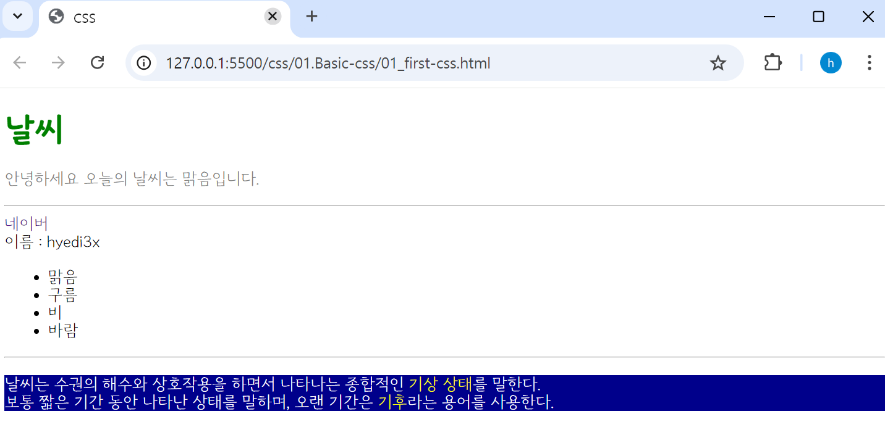
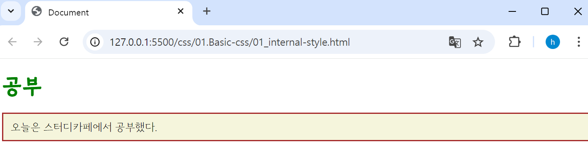
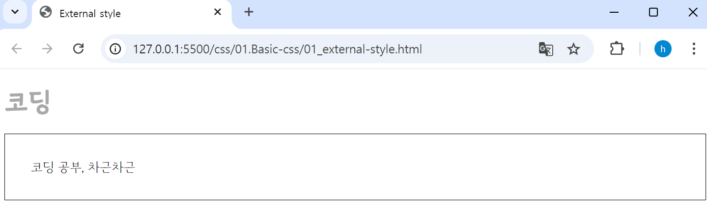

## 🤖 CSS란?
***Cascading Style Sheets***의 약자로, HTML 문서를 꾸밀 때 사용하는 **스타일을 잘 정리한 시트(문서)** 이다. 
> - HTML로 웹 페이지의 뼈대를 만들고, CSS로 웹 페이지를 예쁘게 꾸미는 역할.
```html
<!DOCTYPE html>
<html lang="en">
<head>
    <meta charset="UTF-8">
    <meta name="viewport" content="width=device-width, initial-scale=1.0">
    <title>CSS</title>
    <style>
        /* color : 텍스트 컬러 변경 */
        .p-tag {
            color: gray;
        }

        /* text-decoration: none : 링크속성이 적용된 텍스트에 언더라인 없애기*/
        .delete-line {
            text-decoration: none;
        }

        /* background-color : 텍스트 뒤 컬러 지정 */
        #dark {
            background-color: darkblue;
            color: white;
        }

        /* 클래스 재활용 */ 
        .strong { 
            color : yellow;
        }
    </style>
</head>
<body>
    <!-- html 태그에 바로 style 속성 지정 -->
    <h1 style="color: green">날씨</h1>

    <!-- class 부여하여, style 태그(내부 스타일)에서 해당 클래스와 연결하여 style 속성 지정-->
    <p class="p-tag">안녕하세요 오늘의 날씨는 맑음입니다.</p>
    <hr>

    <a class="delete-line" href="http://www.naver.com">네이버</a> <br>
    <span>이름 : </span><span>hyedi3x</span>
    <ul>
        <li>맑음</li>
        <li>구름</li>
        <li>비</li>
        <li>바람</li>
        </ul>
    <hr>

    <p id="dark">
        날씨는 수권의 해수와 상호작용을 하면서 나타나는 종합적인 <span class="strong">기상 상태</span>를 말한다. <br>
        보통 짧은 기간 동안 나타난 상태를 말하며, 오랜 기간은 <span class="strong">기후</span>라는 용어를 사용한다. 
    </p>
</body>
</html>
```

<br>

### ⚙️ CSS 구조
> 🔩 `선택자(Selector)` : 꾸미고 싶은 html요소를 지정 <br>
> 🔩 `속성명` : 꾸미고 싶은 속성명을 입력<br>
> 🔩 `속성값` : 어떻게 꾸밀지 속성값을 입력 <br>

<br>

### ⚙️ CSS 적용 방법
> 🔩 ***인라인 스타일(Inline Style Sheet)*** <br>
> 🔩 ***내부 스타일(Internal Style Sheet)*** <br>
> 🔩 ***외부 스타일(External Style Sheet)*** <br>

<br>

### ⛏️ 인라인 스타일(Inline Style Sheet)
스타일을 정의하고 싶은 html 요소에 직접 스타일 속성을 지정한다.
```html
<!DOCTYPE html>
<html lang="en">
<head>
    <meta charset="UTF-8">
    <meta name="viewport" content="width=device-width, initial-scale=1.0">
    <title>Inline Style</title>
</head>
<body>
    <!-- 인라인 스타일(Inline Style) : 잘 사용하지 않는 스타일 방법-->
    <h1 style="color : darkgray;">제목</h1>

    <!-- style 값을 여러 개 지정하고 싶다면 ;로 구분한다. -->
    <div style="width: 100px; height: 100px; border: 1px solid red;"></div>
</body>
</html>
```

<br>
>  - 여러 개의 속성을 적용하고 싶다면 ***세미콜론(;)*** 을 사용하여 작성한다. (`style="width: 100px; height: 100px;...`)
>  -  잘 사용하지 않는다.

<br>

### ⛏️ 내부 스타일(Internal Style Sheet)
`<head>` 태그 내부에 `<style>` 태그를 사용하여 정의한다.
```html
<!DOCTYPE html>
<html lang="en">
<head>
    <meta charset="UTF-8">
    <meta name="viewport" content="width=<device-width>, initial-scale=1.0">
    <title>Document</title>
    <!--내부 스타일 - Internal Style Sheet : 잘 사용하지 않는 스타일 방법-->
    <style>
        h1 {
            color : green;
        }

        .content { 
            border: 2px solid brown;
            background-color: beige;
            padding: 10px;
        }
    </style>
</head>
<body>
    <h1>공부</h1>
    <p class="content">오늘은 스터디카페에서 공부했다.</p>
</body>
</html>
```

<br>
>  - 단점 : 사이트에는 많은 페이지가 있는데, 많은 페이지에 **동일한 스타일 규칙을 적용시키기 위해서는 모든 페이지마다 style 태그를 복사해서 붙여 넣어야 함**
>  - 외부 스타일(External Style) 활용 필요.

<br>

### ⛏️ 외부 스타일(External Style Sheet)
외부 스타일은 CSS 파일을 외부에 정의해 놓고, 외부에 정의한 CSS를 HTML 파일에 연결하여 사용하는 것을 말한다.
```html
<!DOCTYPE html>
<html lang="en">
<head>
    <meta charset="UTF-8">
    <meta name="viewport" content="width=device-width, initial-scale=1.0">
    <title>External style</title>
    <!-- 외부 스타일 - External Style Sheet : 관리하기 용이하고, 용량도 적기 때문에 주로 사용되는 방법 -->
    <link rel="stylesheet" href="style.css" />
</head>
<body>
    <h1>코딩</h1>
    <p class="article">코딩 공부, 차근차근</p>
</body>
</html>
```
```css
/* style.css File */
h1 {
    color: darkgray;
}

.article {
    border: 1px solid black;
    padding: 30px;
}
```

<br>
>  - 외부 파일의 확장자 명은 .css이다.
>  - CSS 파일과 HTML 파일을 연결할 때 사용하는 태그가 <link> 태그이다. 
>  - head 태그 내에 선언해야 한다. 
>> - `href 속성` : css 파일의 경로를 적는다. 
>> - `rel 속성` : 연결되는 파일이 html 문서와 어떤 관계인지를 명시한다.
>  - 외부 스타일 시트를 사용하면 관리가 용이하고 용량도 적어 해당 방법을 주로 사용

<br>

### ⚙️ CSS 주석
CSS 주석은 StyleSheet 내에 메모를 남기는 것을 말한다. 
```css
/* 메모 내용 */

/*
메모내용이 여러 줄일 경우 
*/
```