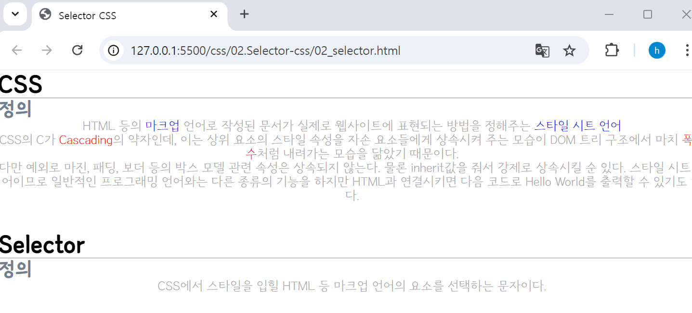

## 🤖 CSS 선택자 - Selector
CSS 규칙(style)을 적용할 요소(태그, 클래스, 아이디 등)를 정의한다. 

### 📃 기본 선택자
⚙️ `전체 선택자 (Universal selector)` : 모든 요소를 선택할 때 사용한다. 
> 🔩 **문법** : `*`
```css
/* * (전체 선택자, Universal selector) : 모든 요소를 선택한다는 의미. */
/* 브라우저 기본 스타일을 초기화할 때 자주 사용하는 선택자이다. */
* {
  margin: 0;
  padding: 0;
}
```

>  자동으로 생긴 여백들이 사라지는 것을 확인할 수 있다. <br>

<br>
<br>

⚙️ `타입 선택자 (Type selector)` : 특정 태그 이름을 가진 모든 요소를 선택하여 스타일을 적용한다.
> 🔩 **문법** : `tagname`
```css
/* Type 선택자 : 특정 태그 이름을 가진 모든 요소를 선택 */
h2 {
  color: slategray;
}
p {
  color: darkgray;
  font-weight: 300px;
  text-align: center;
}
```

>  h2와 p 태그의 컬러색이 지정된 색으로 변경된 것을 확인할 수 있다.  <br>
> p 태그의 콘텐츠들이 가운데 정렬되었으며, 글씨 굵기가 300px로 지정된 것을 확인할 수 있다. 

<br>
<br>

⚙️ `클래스 선택자 (Class selector)` : 지정한 class 명을 가진 모든 요소를 선택해 css style을 적용한다. 
> 🔩 **문법** : `.classname`
```html
<p>
  HTML 등의 <span class="blue">마크업</span> 언어로 작성된 문서가 실제로 웹사이트에 표현되는 방법을 정해주는 <span class="blue">스타일 시트 언어</span>
</p>
<p>
  CSS의 C가 <span class="red">Cascading</span>의 약자인데, 이는 상위 요소의 스타일 속성을 자손 요소들에게 상속시켜 주는 모습이 DOM 트리 구조에서 마치 <span class="red">폭포수</span>처럼 내려가는 모습을 닮았기 때문이다.
</p>
```
```css
/* Class 선택자 : 지정한 class명을 가진 모든 요소를 선택하여 css sytle을 적용한다.  (동일 class로 여러 요소에 적용할 수 있다.) */
.blue {
  color: blue;
}
.red {
  color: red;
}
```

> 지정한 클래스의 컬러색이 지정된 색으로 변경된 것을 확인할 수 있다. <br>
> **동일 class 값으로 여러 요소에 스타일 적용이 가능하다.**

<br>
<br>

⚙️ `ID 선택자 (ID selector)` : id 속성에 맞는 요소를 선택하여 css style을 적용한다. 
> 🔩 **문법** : `#idname`
```html
<h1 id="title">CSS</h1>
```
```css
/* ID 선택자 : id 속성에 맞는 요소를 선택하여 css sytle을 적용한다. (고유한 하나의 태그에만 사용하길 권장한다..)*/
#title {
  font-size: 40px;
  color: white;
  background-color: slategray;
}
```

> **id 선택자는 웹 문서에서 고유한 하나의 태그에만 사용 가능하다. (웹표준)**

<br>
<br>

⚙️ `속성 선택자 (Attribute selector)` : html의 속성을 활용해서 특정 요소를 선택하는 것을 말한다. 
> 🔩 **문법** : `[attr]`, `[attr=value]`, `[attr~=value]`, `[attr|=value]`, `[attr^=value]`, `[attr$=value]`, `[attr*=value]`
```html
  <h2 class="naver">네이버</h2>
  <a href="http://www.naver.com">네이버</a>
  <input type="text" id="text" placeholder="검색어를 입력하세요." />
  
  <h2 class="google">구글</h2>
  <!-- target : blank |  링크 클릭 시 새탭으로 연결-->
  <a href="https://www.google.co.kr/" target="_blank">구글</a>
  
  <h2 class="daum">다음</h2>
  <a href="https://www.daum.net">다음</a>

  <h2 class="title text"> 코딩</h2>
```
```css
/** 속성이 존재하는 모든 요소에 스타일 적용 **/
/* h2 태그 내부의 class 속성이 존재하는 모든 요소에 스타일 적용 */
h2[class] {
  font-size: 50px;
}
/* a 태그 내부의 target 속성이 존재하는 모든 요소에 스타일 적용 */
a[target] {
  color : slategray;
}
/* placeholder 속성이 존재하는 모든 요소에 스타일 적용 */
[placeholder] {
  background-color: black;
  color: white;
}

/** `=` : 속성값과 일치하는 요소(전체 문자열 입력)에 스타일 적용 **/
/* h2 태그 내부의 class 속성값으로 naver가 존재하는 모든 요소에 스타일 적용 */
h2[class='naver'] {
  color: navy;
}

/** `*=` : 속성 값을 포함하는 요소(일부 문자열 입력 가능)에 스타일 적용 **/
/* a 태그 내부의 href 속성값에 www 문자열 포함 시  스타일 적용 */
a[href*='www'] {
  text-decoration: none;  /* 링크 태그 텍스트 하단 줄 숨김 처리 */
}

/**  `^=` : 속성 값으로 끝나는 요소(일부 문자열 입력 가능)에 스타일 적용 **/
/* h2 태그 내부의 class 속성값이 google로 시작하는 모든 요소에 스타일 적용 */
h2[class^='google'] {
  color: blue;
}

/** `~=`  : 속성에 포함된 단어 요소(문자열 중 일부 단어 포함이 아닌, 단어 그 자체)에 스타일 적용 **/
/* a 태그 내부의 href 속성값이 daum.net으로 끝나는  문자열 포함 시  스타일 적용 */
h2[class~='text'] {
  color: red;
  font-size: 30px;
}
```

> ↓ CSS 속성값 적용 후 


> **id 선택자는 웹 문서에서 고유한 하나의 태그에만 사용 가능하다. (웹표준)**

<br>
<br>

### 📃 그룹 선택자
선택자를 `쉼표(,)`로 구분해 여러 선택자를 나열한다.
-   같은 스타일을 여러 선택자에 한꺼번에 정의할 수 있다.<br>

<br>

> 🔩 **문법**  : `선택자1, 선택자2 { 스타일 규칙 }`
```css
/** 선택자를 쉼표(,)로 구분해 여러 선택자를 나열 **/
h2, input { 
  text-align: center;     /* 요소들을 가운데 정렬 */
}
```

> h2, input 태그 속 요소들이 가운데 정렬된 것을 확인할 수 있다. (a태그는 해당 속성이 적용되지 않는다.)
