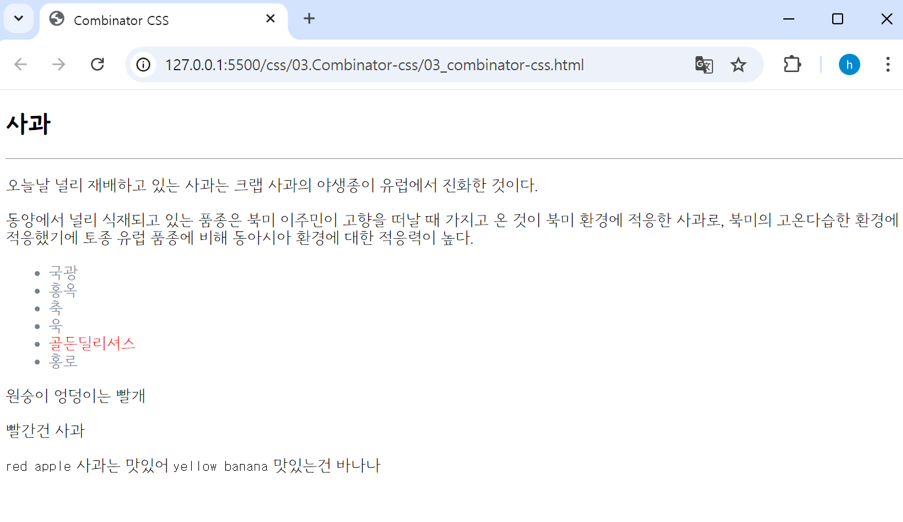
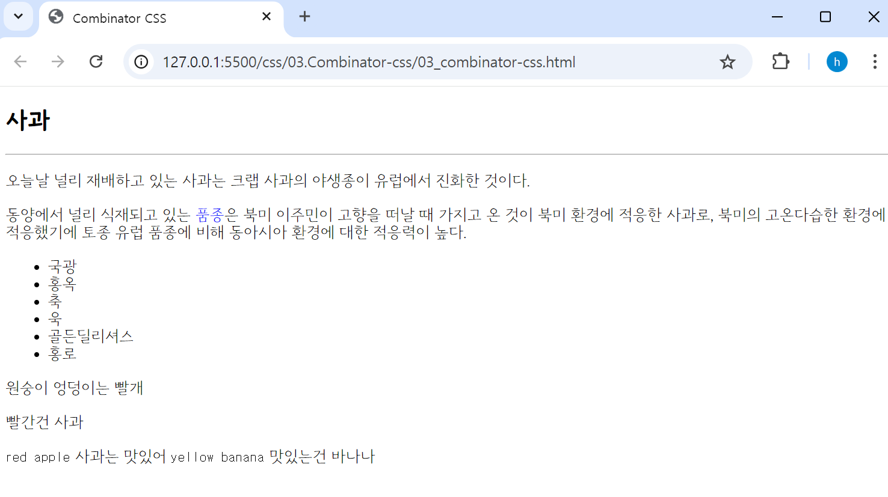
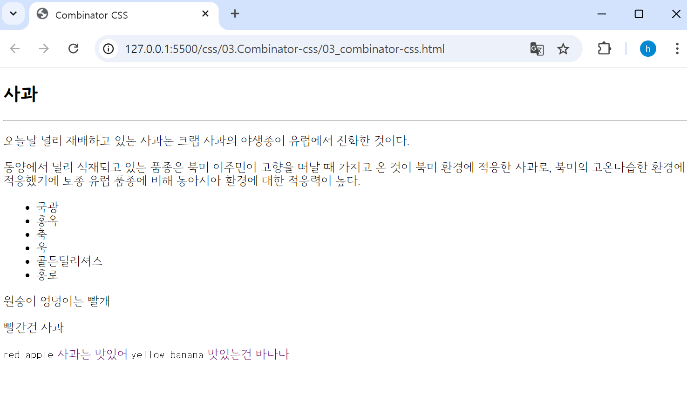
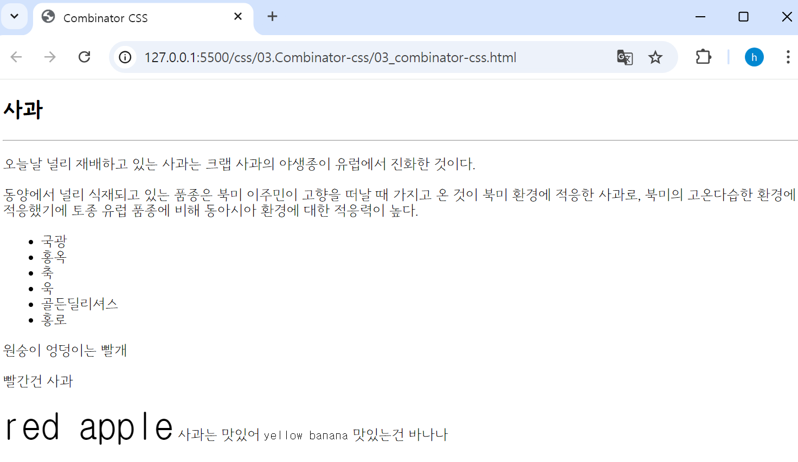

## 🤖 결합자 
CSS 결합자에는 자손결합자, 자식 결합자, 일반 형제 결합자, 인접 형제 결합자가 있다. <br>

### ⚙️ 자손 결합자
첫 번째로 지정한 태그의 하위 자손 태그 모두를 선택한다. 
> 🔩 **문법**  : `A` `B` 
```html
<section>
  <h1>사과</h1>
  <hr />
  <p>오늘날 널리 재배하고 있는 사과는 크랩 사과의 야생종이 유럽에서 진화한 것이다. </p>
  <p>동양에서 널리 식재되고 있는 <span>품종</span>은 북미 이주민이 고향을 떠날 때 가지고 온 것이 북미 환경에 적응한 사과로, 북미의 고온다습한 환경에 적응했기에 토종 유럽 품종에 비해 동아시아 환경에 대한 적응력이 높다. </p>
  <ul>
    <li>국광</li>
    <li>홍옥</li>
    <li>축</li>
    <li>욱</li>
    <li><div>골든딜리셔스</div></li>
    <li>홍로</li>
  </ul>
</section>
```
```css
/** 자손 결합자 : 첫번째로 지정한 태그의 하위 자손 태그 모두를 선택한다. **/
section li { 
  color: slategray;
}
section div { 
  color: red;
}
```

`li 태그`와 `div 태그`는 `section 태그`의 **자손 태그**이므로, *지정한 style 값이 잘 적용*된 것을 확인할 수 있다. <br>
<br>
<br>

### ⚙️ 자식 결합자
첫 번째 요소의 바로 아래 자식인 태그를 선택한다.
> 🔩 **문법**  : `A > B` 
```html
<section>
  <h1>사과</h1>
  <hr />
  <p>오늘날 널리 재배하고 있는 사과는 크랩 사과의 야생종이 유럽에서 진화한 것이다. </p>
  <p>동양에서 널리 식재되고 있는 <span>품종</span>은 북미 이주민이 고향을 떠날 때 가지고 온 것이 북미 환경에 적응한 사과로, 북미의 고온다습한 환경에 적응했기에 토종 유럽 품종에 비해 동아시아 환경에 대한 적응력이 높다. </p>
  <ul>
    <li>국광</li>
    <li>홍옥</li>
    <li>축</li>
    <li>욱</li>
    <li><div>골든딜리셔스</div></li>
    <li>홍로</li>
  </ul>
</section>
```
```css
/** 자식 결합자 : 첫 번째 요소의 바로 아래 자식인 태그를 선택한다. **/
p > span  { 
  color: blue;
}
/* section 바로 하위 자식태그가 아니기에 span 태그에 스타일 적용되지 않았다. */
section >  div { 
  border: 2px solid black;
} 
```

`p 태그`의 **바로 하위 자식 태그인** `span 태그`에 *지정한 style 값은 잘 적용*되었으나, `div 태그`는 `li 태그`의 **자식 태그로써**, `section 태그`의 **자손 태그로**, *style 값이 적용되지 않은 것*을 확인할 수 있다.  <br>
<br>
<br>

### ⚙️ 일반 형제 결합자
첫 번째 요소를 뒤따르면서 같은 부모를 공유하는 두 번째 요소를 선택한다. 
> 🔩 **문법**  : `A ~ B ` 
```html
<section>
  <span>원숭이 엉덩이는 빨개</span>
  <p>빨간건 사과</p>
  <code>red apple</code>
  <span>사과는 맛있어</span>
  <code>yellow banana</code>
  <span> 맛있는건 바나나</span>
</section>
```
```css
/* 일반 형제 결합자 : 첫 번째 요소를 뒤따르면서 같은 부모를 공유하는 두 번째 요소를 선택 */
p ~ span {    /* <p>태그의 뒤에(아래) 나오는 모든 <span>요소 */
	color: purple;
}
```

`p 태그` **하위의 형제 요소인** `span 태그`만 *style 값이 적용*되었고, `p 태그` **상위의 형제 요소인** `span 태그`는 *style 값이 적용되지 않은 것*을 확인할 수 있다.  <br>
<br>
<br>

### ⚙️ 인접 형제 결합자
첫 번째 요소의 바로 뒤에 위치하면서 같은 부모를 공유하는 두 번째 요소만 선택한다. 
> 🔩 **문법**  : `A + B ` 
```html
<section>
  <span>원숭이 엉덩이는 빨개</span>
  <p>빨간건 사과</p>
  <code>red apple</code>
  <span>사과는 맛있어</span>
  <code>yellow banana</code>
  <span> 맛있는건 바나나</span>
</section>
```
```css
/* 인접 형제 결합자 : 첫 번째 요소의 바로 뒤에 위치하면서 같은 부모를 공유하는 두 번째 요소만 선택 */
p + code {
	font-size: 40px;
}
```

첫 번째 요소 `p 태그` **바로 하위의 형제 요소인** `code 태그`만 *style 값이 적용*되었고, `span태그` **하위의 형제 요소인** `code 태그`는 *style 값이 적용되지 않은 것*을 확인할 수 있다.  <br>
<br>
<br>