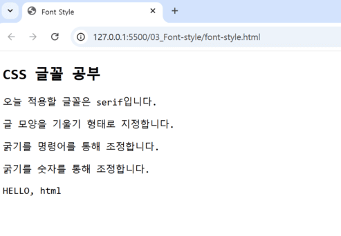
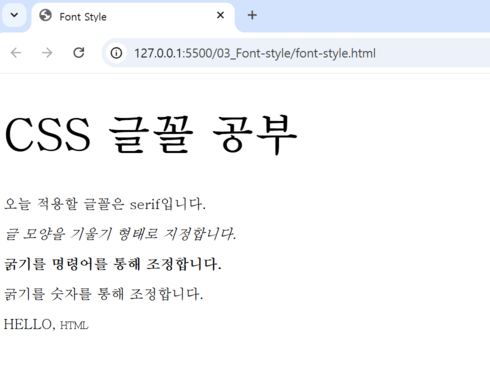
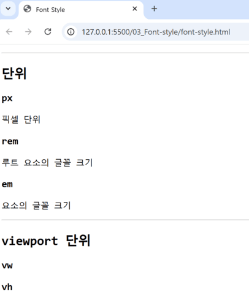
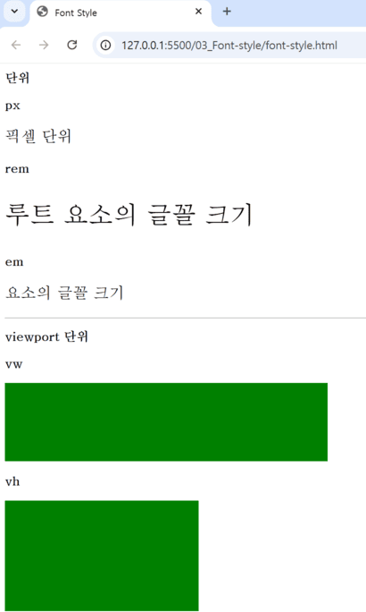

# 🤖 Font Style (CSS)
CSS에 주로 사용되는 font 속성  <br>

## 📃 글꼴 관련 속성(웹폰트, 글꼴 단위)
### ⚙️ 글꼴 관련 주요 속성 
> 🔩 `font-family` : '글꼴 종류'를 지정한다. (default ; 브라우저 기본 글꼴) <br>
> 🔩 `font-size` : '글자 크기'를 지정한다. <br>
> 🔩 `font-style` : 글자를 '이탤릭체'로 표시할지 지정한다. <br>
> 🔩 `font-weight` : '글자 굵기'를 지정한다. <br>
> 🔩 `font-variant` : '소문자를 크기가 작은 대문자로 바꾸는' 속성이다. <br>

```html
<!-- 폰트 속성 -->
<h2 class="title">CSS 글꼴 공부</h2>
<p class="content">오늘 적용할 글꼴은 serif입니다.  </p>
<p class="italic">글 모양을 기울기 형태로 지정합니다.  </p>
<p class="weight-bold">굵기를 명령어를 통해 조정합니다.  </p>
<p class="weight-100">굵기를 숫자를 통해 조정합니다.  </p>
<p class="variant">HELLO, html</p>
```
```css
/* 모든 요소 서체를 serif로 설정, serif 적용 불가 시 다음 서체인 monospace로 글꼴 적용*/ 
*  {
  font-family : serif, monospace;    /* 글자 종류를 지정. */ 
  font-size: 16px;
}

.title { 
  font-size: 50px;   /* 글자 크기를 지정. */ 
}

.italic {
  font-style: italic;  /* 글자를 이탤릭체로 표현할지 지정. */ 
}

.weight-bold {
  font-weight: bold;  /* 굵기를 명령어를 통해 조정 */
}

.weight-100 {
  font-weight: 100;  /* 굵기를 숫자를 통해 조정 */
}

.variant {
  font-variant: small-caps;   /* 소문자 요소를 크기가 작은 대문자로 표현 */
}
```
> ⛏️ **[css 적용 전]** <br>
> 
 <br>

> 🪄 **[css 적용 후]** <br>
> 

<br> <br>

### ✒️ 웹 폰트
사용자의 컴퓨터에 설치된 폰트와 상관없이, 온라인의 특정 서버에 위치한 폰트 파일을 다운로드하여 화면에 표출하는 ‘웹 전용 폰트’이다. <br>  
<br>  

⚙️ `구글 웹 폰트` : 구글 웹 폰트 사이트에 방문하여, `<link>` 또는 `@import 문`을 사용하여 웹 폰트를 적용할 수 있다.   <br>  
> * https://fonts.google.com/

<br> <br>  

💡 웹 폰트 적용 방법 
***@import 방법***은 `<head>` 태그 내부에 `<style>` 태그를 선언하고, 그 안에 url을 입력하면 된다. 
> → (css 내부에 font-family로 적용하면 된다.)
```html
<style>
@import url('https://fonts.googleapis.com/css2?family=Roboto:ital,wght@0,100;0,300;0,400;0,500;0,700;0,900;1,100;1,300;1,400;1,500;1,700;1,900&display=swap');

.roboto {
  font-family: "Roboto", sans-serif;
}
</style>
```
<br> <br>  

***`<link>` 방법***은 `<head>` 태그 내부에 `<link>` 태그를 선언하고, 아래 코드들을 복사 붙여넣기하면 된다.
> → (css 내부에 font-family로 적용하면 된다.)

```html
<link rel="preconnect" href="https://fonts.googleapis.com">
<link rel="preconnect" href="https://fonts.gstatic.com" crossorigin>
<link href="https://fonts.googleapis.com/css2?family=Roboto:ital,wght@0,100;0,300;0,400;0,500;0,700;0,900;1,100;1,300;1,400;1,500;1,700;1,900&display=swap" rel="stylesheet">

<style>
.roboto {
  font-family: "Roboto", sans-serif;
}
</style>
```
<br> <br>  

### ⚙️ 단위 em, rem (글꼴, width, height 등에 사용됨)
> 🔩 `px` : 픽셀 단위 <br>  
> 🔩 `rem` : 루트 요소의 글꼴 크기 *(루트=최상위 요소에 상응하는 크기)* <br>  
> 🔩 `em` : 요소의 글꼴 크기 *(현재 자기 자신, 부모에게 상속받은 크기에 상응하는 크기)* <br>  
> 🔩 `vw` : viewport 너비의 1% *(viewport : 전체 화면 크기, 100vw = 전체 화면 너비)* <br>  
> 🔩 `vh` : viewport 높이의 1% *(viewport : 전체 화면 크기, 100vh = 전체 화면 높이)* <br>  

```html
<!-- 폰트 크기 단위 -->
<h2>단위</h2>
<h3>px</h3>
<p class="size-px">픽셀 단위</p>
<h3>rem</h3>
<p class="size-rem">루트 요소의 글꼴 크기</p>
<h3>em</h3>
<div class="article">
  <p class="size-em">요소의 글꼴 크기</p>
</div>
<hr>
<!-- 폰트 크기 viewport -->
<h2>viewport 단위</h2>
<h3>vw</h3>
<div class="rectangle-width"></div>
<h3>vh</h3>
<div class="rectangle-height"></div>
```
```css
/***  폰트 크기 단위  ***/ 
.size-px {
  font-size: 20px;  /* 글꼴 크기를 픽셀 단위로 지정 */
}

.size-rem { 
  font-size: 2rem; /* 루트=최상위 요소에 상응하는 크기, 16px의 2배인 32px 적용 */
}

.article {
  font-size: 10px;
}

.size-em {
  font-size: 2em;  /* 현재 자기 자신, 부모에게 상속받은 크기에 상응하는 크
  기, 10px의 2배인 20px 적용 */
}

/***  폰트 크기 viewport  ***/ 
.rectangle-width {
  width: 50vw;  /* 전체 화면 너비의 50%만 채운다.*/
  height: 100px;
  background-color: green;
}

.rectangle-height {
  width: 30vw;  /* 전체 화면 너비의 30%만 채운다.*/
  height: 20vh;  /* 전체 화면 높이의 20%만 채운다.*/
  background-color: green;
}
```
> ⛏️ **[css 적용 전]** <br>
> 
 <br>

> 🪄 **[css 적용 후]** <br>
> 

<br> <br>