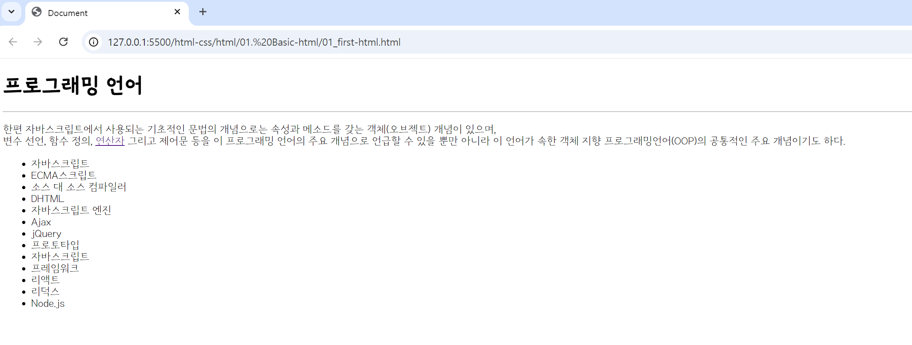

## 🤖 맛보기로 제작한 html에 사용된 태그 간단 설명서
`<h1></h1>` : html 문서에서 ***제목(heading)*** 을 정의할 때 사용한다. →  h1 요소가 가장 중요한 제목을 정의 <br>
`<hr>` : 콘텐츠 내용에서 주제가 바뀔 때 사용하는 ***수평 가로선***을 표현한다.<br>
`<p></p>` : ***문단(paragraph)*** 을 정의할 때 사용한다, 브라우저는 자동으로 p 요소의 위쪽과 아래쪽에 약간의 여백을 추가한다. <br>
`<br>` : 텍스트 내의 ***줄바꿈(line-break)*** 을 정의할 때 사용한다.<br>
`<a></a>` : 하나의 페이지에서 다른 페이지를 연결하는 ***하이퍼링크(hyperlink)*** 를 정의할 때 사용한다.<br>
`<ul></ul>` : ***순서가 없는 HTML 리스트(list)를 정의*** 할 때 사용한다. <br>
`<ol></ol>` : ***순서가 있는 리스트(ordered list)를 정의*** , 아라비아 숫자/알파벳으로 표현한다. <br>
`<li></li>` : HTML ***리스트(list)에 포함되는 아이템(item)을 정의*** 할 때 사용한다.

<br>

```html
<!--html 구조-->
<h1>텍스트</h1>
<hr>
<p>
    텍스트, <br> 텍스트 <a href="링크">텍스트</a>
</p>
<ul>
    <li>텍스트</li>
    <li>텍스트</li>
</ul>
```    
