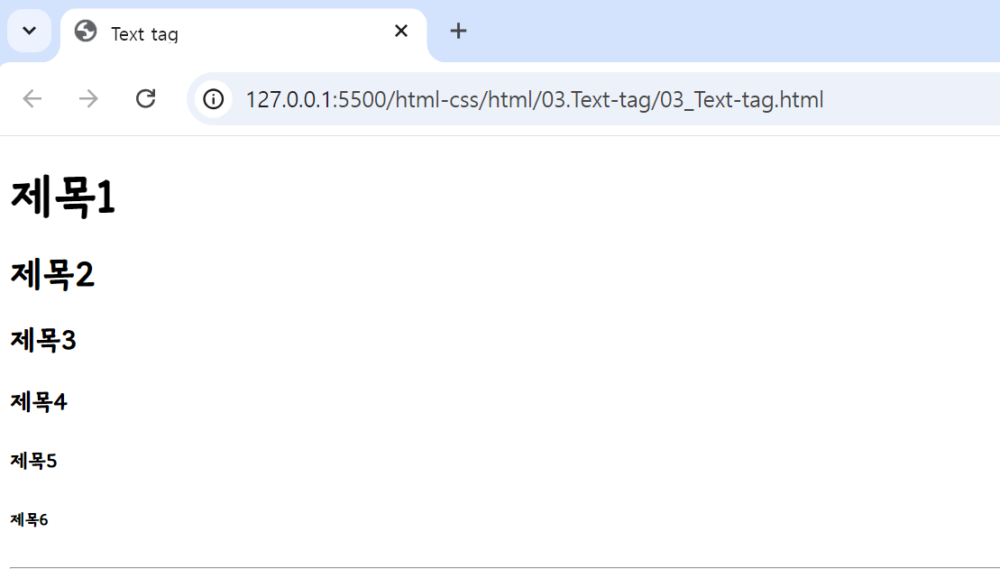
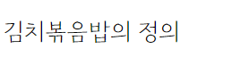
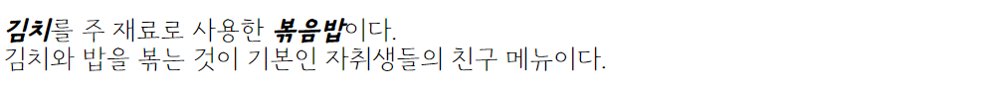

## 🤖 자주 쓰이는 text 태그 (html-ver)
#### 🔎 소개되는 태그들은 html에서 주로 쓰이는 텍스트 관련 태그들이다. 
<br>

⚙️ `<h1>~<h6>` : heading, **웹 페이지의 제목 또는 부제목을 표현할 때 사용**하며, 숫자가 작을수록 큰 제목을 표현한다. <br>
(이미지 속 브라우저 폰트는 브라우저 환경의 폰트를 변경한 상태-css속성x) <br>
```html
<h1>제목1</h1>
<h2>제목2</h2>
<h3>제목3</h3>
<h4>제목4</h4>
<h5>제목5</h5>
<h6>제목6</h6>
```

<br>

⚙️ `<hr>` : Horizontal Rule, 가로로 수평선을 긋는 태그. (종료태그 X)
```html
<hr />
```

<br>

⚙️ `<p>~</p>` : Paragraph, **하나의 문단**을 표시할 때 사용한다. 
```html
<p>김치볶음밥의 정의</p>
```

<br>

⚙️ `<br>` : Break, **줄바꿈 태그**로 html에서 개행 역할을 한다. (종료태그 X) <br>
⚙️ `<i>` : Italic, 텍스트를 ***이탤릭체***로 표시할 때 사용한다. <br>
⚙️ `<em>` : Emphasis, 텍스트를 ***이탤릭체로 강조***할 때 사용한다. <br>
⚙️ `<b>` : Bold, 텍스트를 **진하게** 표시할 때 사용한다. <br> 
⚙️ `<strong>` : 텍스트를 **진하게 강조**할 때 사용한다. <br> 

```html
<p>
    <b><i>김치</i></b>를 주 재료로 사용한 <strong><em>볶음밥</em></strong>이다.
    <br />
    김치와 밥을 볶는 것이 기본인 자취생들의 친구 메뉴이다.
</p>
```


---
<br>

💡 **Tag 참조 사이트** <br>
https://www.tcpschool.com/html-tags/intro
<br></br>