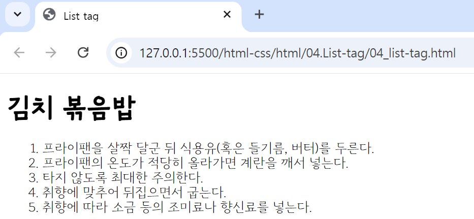
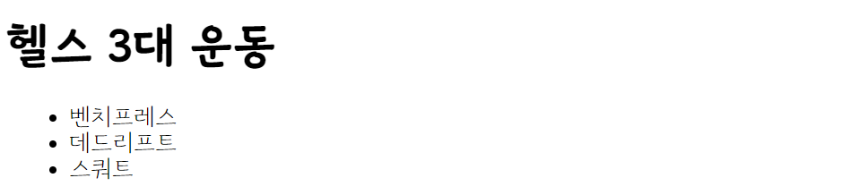
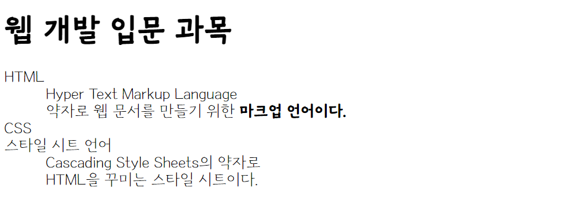

## 🤖 자주 쓰이는 List 태그 (html-ver)
#### 🔎 소개되는 태그들은 html에서 주로 쓰이는 리스트(목록) 관련 태그들이다. 
<br>

⚙️ `<ol></ol>` : Ordered List, **순서가 있는 목록**을 표현할 때 사용한다. type 속성으로 글머리 기호를 변경할 수 있다. <br>
> 🔩 `<li></li>` : Listed Item, 목록 태그[ul 태그/ol 태그]의 하위 항목으로 위치한다. (이미지 속 브라우저 폰트는 브라우저 환경의 폰트를 변경한 상태-css속성x)
```html
<h1>김치 볶음밥</h1>
<ol>
    <li>프라이팬을 살짝 달군 뒤 식용유(혹은 들기름, 버터)를 두른다.</li>
    <li>프라이팬의 온도가 적당히 올라가면 계란을 깨서 넣는다.</li>
    <li>타지 않도록 최대한 주의한다.</li>
    <li>취향에 맞추어 뒤집으면서 굽는다.</li>
    <li>취향에 따라 소금 등의 조미료나 향신료를 넣는다.</li>
</ol>
```

<br>

⚙️ `<ul></ul>` : Unordered List, **순서가 없는 목록**을 표현할 때 사용한다. 
```html
<h1>헬스 3대 운동</h1>
<ul>
    <li>벤치프레스</li>
    <li>데드리프트</li>
    <li>스쿼트</li>
</ul>
```

<br>

⚙️ `<dl></dl>` : Definition List, **사전처럼 용어를 설명하는 목록**을 만든다. 
> 🔩 `<dt></dt>` : Definition Term, 정의되는 **용어의 제목**을 넣을 때 사용한다. <br>
> 🔩 `<dd></dd>` : Definition Description, **용어를 설명**하는 데 사용한다. 
```html
<h1>웹 개발 입문 과목</h1>
<dl>
    <dt>HTML</dt>
    <dd>
        Hyper Text Markup Language <br> 약자로 웹 문서를 만들기 위한 <strong>마크업 언어이다.</strong>
    </dd>
    <dt>CSS</dt>
    <dt>스타일 시트 언어</dt>
    <dd>
        Cascading Style Sheets의 약자로 <br> HTML을 꾸미는 스타일 시트이다.
    </dd>
</dl>
```

<br>

---
<br>

💡 **Tag 참조 사이트** <br>
https://www.tcpschool.com/html-tags/intro
<br></br>