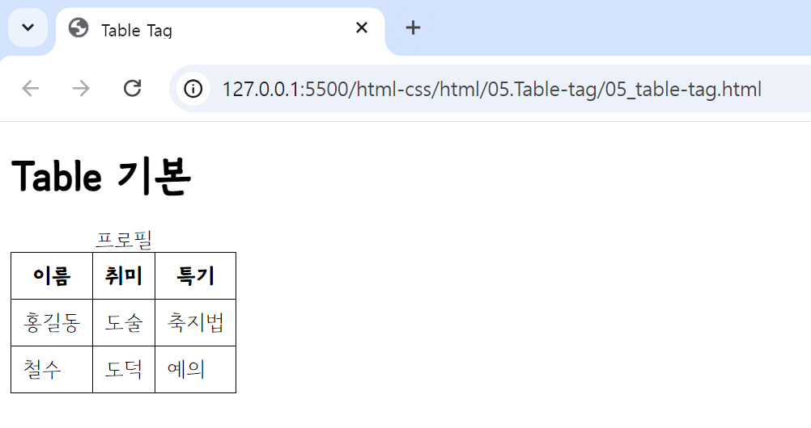
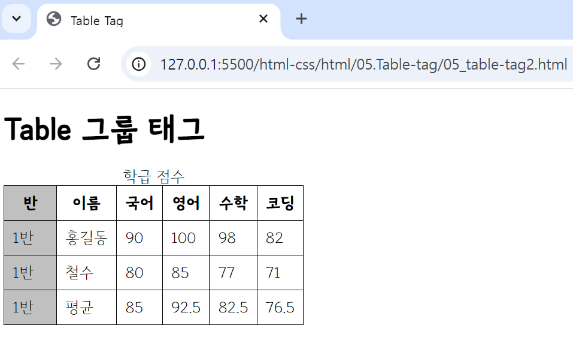

## 🤖 자주 쓰이는 Table 태그 (html-ver)
#### 🔎 소개되는 태그들은 html에서 주로 쓰이는 테이블(표) 관련 태그들이다. 
<br>

### Table 기본 태그
⚙️ `<table></table>` : 데이터를 포함하는 셀(cell)들의 **행과 열로 구성된 2차원 테이블**을 정의할 때 사용한다. <br>
> 🔩 `<caption>~</caption>` : **표의 제목이나 설명(description)**을 작성하는 태그. <br>
> 🔩 `<tr>~</tr>` : 표의 **행**을 의미하는 태그. <br>
> 🔩 `<th>~</th>` : 표의 **제목 열**을 의미하는 태그. <br>
> 🔩 `<td>~</td>` : 표의 **일반 열**을 의미하는 태그. <br>
> 📃 (이미지 속 브라우저 폰트는 브라우저 환경의 폰트를 변경한 상태-css속성x)
```html
<h1> Table 기본 </h1>
<table>
    <caption> 프로필 </caption>
    <tr>
        <th>이름</th>
        <th>취미</th>
        <th>특기</th>
    </tr>
        ...
</table>
```

<br>

### Table 그룹 태그
⚙️ `<thead></thead>` : 표의 **제목 열(th)들을 묶는** 그룹 태그이다. <br>
⚙️ `<tbody></tbody>` : 표의 **일반적인 데이터들을 묶는** 그룹 태그이다. <br>
⚙️ `<tfoot></tfoot>` : 표의 **하단 영역을 묶는** 그룹 태그이다. <br>
⚙️ `<colgroup></colgroup>` : **열을 그룹**으로 묶을 수 있도록 해주는 태그이다. <br>
> 🔩 `<col></col>` : colgroup 태그의 자식 태그로, **열 단위**로 테이블을 나눌 수 있다. span 속성을 사용하여 열을 그룹으로 묶을지 설정할 수 있다. <br>
```html
<table>
    <caption>학급 점수</caption>
    <colgroup>
        <col class="col1">
             ...
        <col class="col6">
    </colgroup>
    <thead>
        <tr>
            <th>반</th>
             ...
            <th>코딩</th>
        </tr>
    </thead>
    <tbody>
        <tr>
            <td>1반</td>
             ...
            <td>82</td>
        </tr>
        <tr>
            <td>1반</td>
             ...
            <td>71</td>
        </tr>
    </tbody>
    <tfoot>
        <tr>
            <td>1반</td>
             ...
            <td>76.5</td>
        </tr>    
    </tfoot>
</table>
```


---
<br>

💡 **Tag 참조 사이트** <br>
https://www.tcpschool.com/html-tags/intro
<br></br>