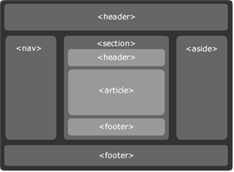

## 🤖 Semantic 태그 
#### 🔎 Semantic의 사전적 의미는 ‘의미론적’이라는 뜻으로, HTML에서 Semantic Tag란 "의미를 가지는 태그"를 말한다.
 

### Semantic 태그의 이점 : 
-  검색엔진 최적화 (브라우저 검색엔진 상단에 배치)
-  웹 접근성 향상 (화면 낭독기에 최적화)
-  가독성 향상 
 

### Semantic 태그
⚙️ `<header></header>` : 페이지에 대한 정보를 담는 태그로, 페이지 상단에 위치.  
⚙️ `<nav></nav>` : 다른 페이지나 같은 페이지 안에 다른 부분으로 이어주는 내비게이션 링크로 구성된 section을 표현.  
⚙️ `<aside></aside>` : 페이지 전체 내용과는 어느 정도 관련성이 있지만, 주요 내용과는 직접적인 연관성은 없는 분리된 내용.  
⚙️ `<main></main>` : 문서의 body 요소의 주 콘텐츠(main content)를 정의할 때 사용.  
⚙️ `<section></section>` : 문서나 응용프로그램의 일반적인 section을 표현.  
⚙️ `<article></article>` : article은 여러 가지 아이템들을 묶어 재사용이 가능하게 그룹화함.  
⚙️ `<footer></footer>` : 주로 저작권 정보나 서비스 제공자 정보 등을 나타내며 사이트 하단에 위치.  
⚙️ `

` : 추가적인 정보를 나타내거나 사용자가 요청하는 정보를 표현.  
⚙️ `

` : 부모 요소인 *details 요소*의 내용에 대한 요약이나 캡션 등을 나타냄.  
⚙️ `<figure></figure>` : 일러스트, 다이어그램, 사진, 코드 등에 주석을 다는 용도로 사용.  
⚙️ `<figcaption></figcaption>` : 부모 요소인 *figure 요소*의 내용에 대한 제목이나 캡션 등을 나타냄.  
⚙️ `<mark></mark>` : 하나의 문서 내에서 다른 문맥과의 관련성을 나타내기 위해서 참조 목적으로 마킹되거나 하이라이트된 텍스트를 표현.  
⚙️ `<time></time>` : 24시간에서의 시간 혹은 그레고리력에서의 정밀한 날짜를 나타냄.  
  
 
### HTML5 Semantic 태그 기반 페이지 레이아웃
일반적인 HTML 페이지는 페이지 머리글(header), 바닥글(footer) 및 중간 페이지(main) 콘텐츠가 있다. 
 
 

 

⚙️ `<header>` : section의 제목을 포함하기 위한 것이며 섹션의 목차, 검색 양식, 로고 등을 래핑할 수 있다.   
⚙️ `<footer>` : 작성자 정보, 관련 문서에 대한 링크, 저작권 데이터 등과 같은 section에 대한 정보를 포함  
⚙️ `<nav>` : 다른 페이지 또는 페이지 내의 부분으로 연결되는 페이지의 section이다. 일반적으로 탐색 링크가 있다.  
⚙️ `<aside>` : 콘텐츠가 옆 요소 주변의 콘텐츠와 접선적으로 관련되어 있는 경우 해당 콘텐츠와 분리된 것으로 간주된다. (ex. 인용문 또는 사이드바, 광고 등) 
⚙️ `<section>` : 논리적 또는 물리적으로 그룹화된 일반 콘텐츠를 포함한다. 문서 또는 응용프로그램, 예를 들어 웹 사이트의 홈페이지는 소개, 뉴스 항목, 연락처 정보에 대한 section으로 분할될 수 있다.  
⚙️ `<article>` : 문서, 페이지, 응용프로그램 또는 사이트에 독립적으로 배포될 수 있는 자체 포함된 구성이다.  