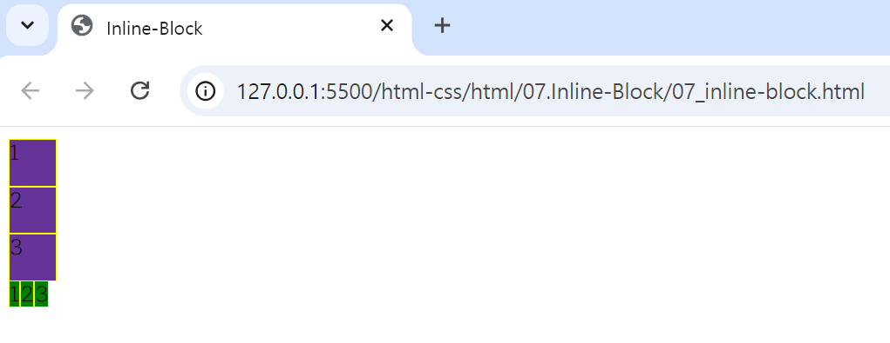
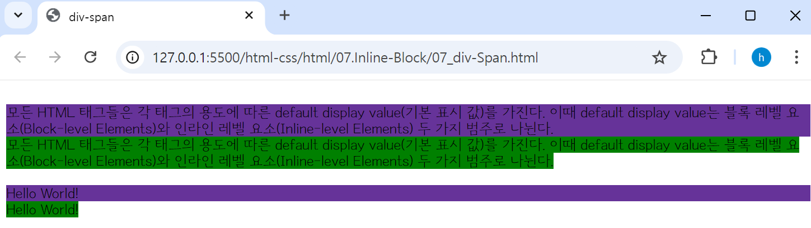

## 🤖 Inline - Block Element
#### 🔎 모든 HTML 태그들은 각 태그의 용도에 따른 default display value (기본 표시 값)를 가진다. 
- 이때 default display value는 블록 레벨 요소(Block-level Elements)와 인라인 레벨 요소(Inline-level Elements) 두 가지 범주로 나뉜다.
<br>

### Block Element
블록 레벨 요소는 부모 요소의 전체 공간을 차지하여 **블록**을 만든다. `<h1>~<h6>`, `<ol>`, `<ul>`, `<li>`, `<p>`, `<div>` 태그 등이 블록 요소에 속한다. <br>
> 🔩 화면 구성이나 레이아웃을 짤 때는 블록 레벨 요소를 사용. <br>
> 🔩 테트리스 블록처럼 층층이 쌓여가는 게 특징이다.  <br>
> 🔩 블록 레벨 요소는 한 칸을 모두 차지하기 때문에 ***세로로 나열***. <br>
> 🔩 ***width, height, margin 속성 적용 O.***  <br>
> 🔩 블록 요소 안에 블록 요소 포함 가능 O <br>
> 🔩 블록 요소 안에 인라인 요소 포함 가능 O <br>

### Inline Element
인라인 레벨 요소는 콘텐츠의 흐름을 끊지 않고(줄바꿈X), 요소를 구성하는 태그에 **할당된 공간만 차지**한다. `<a>`, `<em>`, ``, `<span>`, `<input>`, `<strong>` 태그 등이 인라인 요소에 속한다.
> 🔩 인라인 레벨 요소는 콘텐츠 영역만큼 차지하기 때문에 ***가로로 나열.*** <br>
> 🔩 ***margin-top, margin-bottom 적용되지 않는다(좌우만 가능).*** 대신에 **line-height 속성 이용.** <br>
> 🔩 ***width, height 속성 적용 x.*** <br>
> 🔩 태그가 콘텐츠의 할당 된 공간만 갖고 있기에, ***text-align과 같은 속성 적용 x.***  <br>
> 🔩 인라인 요소 안에는 인라인 요소 포함 가능 O. <br>
> 🔩 인라인 요소 안에 블록 요소 포함 불가. <br> 
> 🔩 자신의 부모의 가로 폭 보다 현재의 가로 폭이 길면 다음 줄로 넘어간다. <br>

```html
<!DOCTYPE html>
<html lang="en">
<head>
    <meta charset="UTF-8">
    <meta name="viewport" content="width=device-width, initial-scale=1.0">
    <title>Inline-Block</title>
    <style>
        div {
            background-color: rebeccapurple;
            width: 30px;
            height: 30px;
            border: 1px solid yellow;
        }
        span {
            background-color: green;
            width: 30px;
            height: 30px;
            border: 1px solid yellow;
        }
    </style>
</head>
<body>
    <div>1</div>
    <div>2</div>
    <div>3</div>
    <span>1</span><span>2</span><span>3</span>
</body>
</html>
```

<br>

### div 태그 / span 태그
페이지 영역을 구분할 때 사용하는 태그로, `div` 태그와 `span` 태그가 있다. 

⚙️ `<div></div>` : Division, HTML 안에 존재하는 여러 개의 태그들을 div 라는 큰 단위로 묶어주는 ***컨테이너(박스처럼) 같은 역할***이다. (영역 구분, 분할에 사용)
>  div는 block 요소이다. <br>

<br>

⚙️ `<span></span>` : 영역 태그로, ***특정 텍스트나 문장 영역을 지정하여 묶는 역할***을 한다.
>  span은 Inline 요소이다.

```html
<!DOCTYPE html>
<html lang="en">
<head>
    <meta charset="UTF-8">
    <meta name="viewport" content="width=device-width, initial-scale=1.0">
    <title>div-span</title>
    <style>
        div {
            background-color: rebeccapurple;
        }
        span {
            background-color: green;
        }

    </style>
</head>
<br>
    <div>
        모든 HTML 태그들은 각 태그의 용도에 따른 default display value(기본 표시 값)를 가진다. 이때 default display value는 블록 레벨 요소(Block-level Elements)와 인라인 레벨 요소(Inline-level Elements) 두 가지 범주로 나뉜다.
    </div>
    <span>
        모든 HTML 태그들은 각 태그의 용도에 따른 default display value(기본 표시 값)를 가진다. 이때 default display value는 블록 레벨 요소(Block-level Elements)와 인라인 레벨 요소(Inline-level Elements) 두 가지 범주로 나뉜다.
    </span>
    <br>
    <br>
    <div>Hello World!</div>
    <span>Hello World!</span>
</body>
</html>
```
