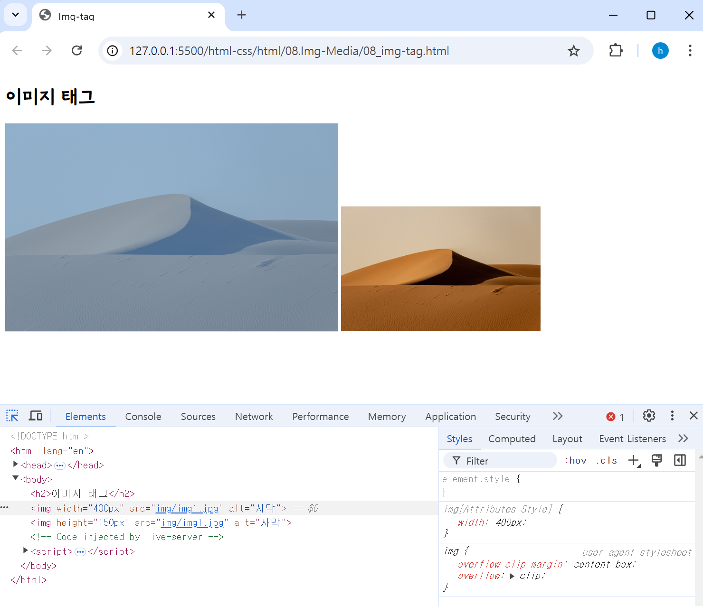
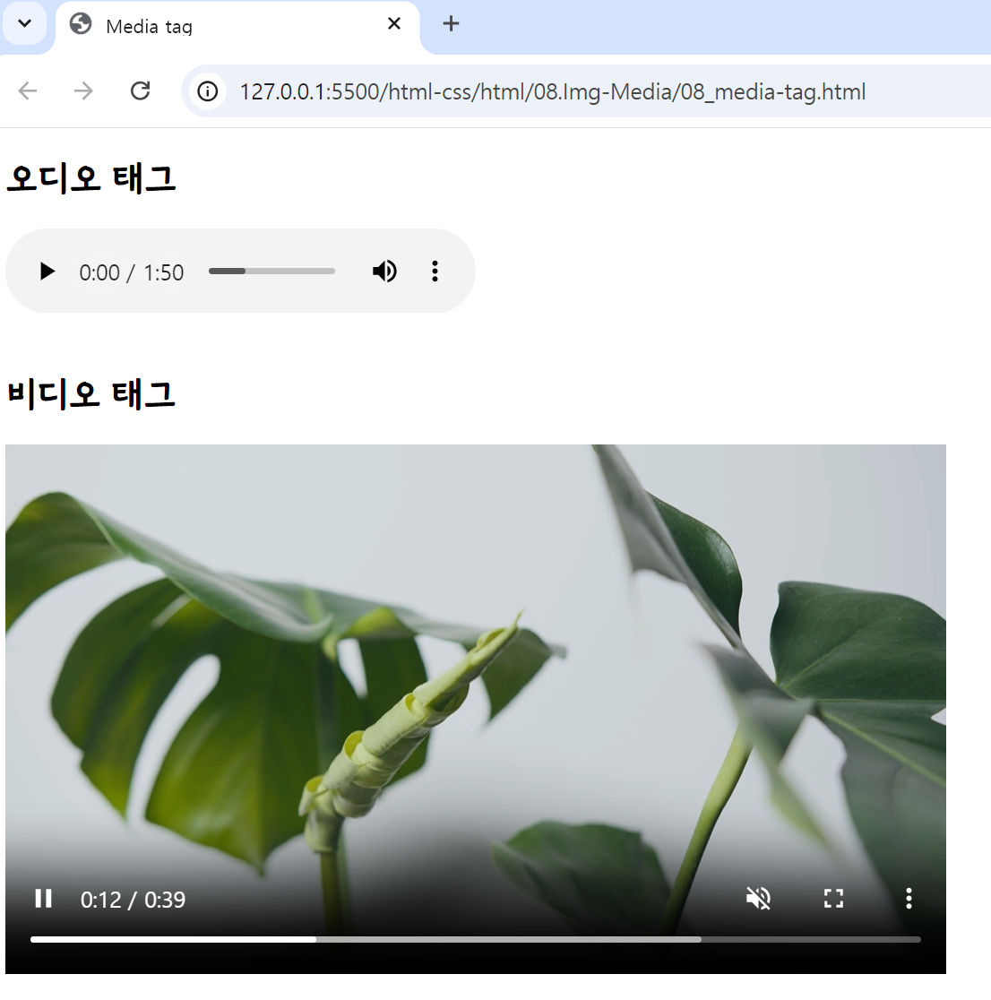

## 🤖 이미지 & 멀티미디어 태그
### 🎱 img 태그 
HTML Document에 이미지를 넣을 수 있는 태그다.
```html

```
<br>

### ⚙️ img 태그 속성 
🔩 `src` : img 태그 필수 속성이며, **이미지의 경로를 지정.** <br>
🔩 `alt` : 필수 속성은 아니나 해당 **이미지에 대한 설명**을 추가할 수 있다. <br>
- 스크린 리더가 alt의 값을 읽어 사용자에게 이미지를 설명하므로, *웹 접근성에 유용*. <br>
- 네트워크 오류, 콘텐츠 차단, 죽은 링크 등 이미지를 표시할 수 없을 때, 디스플레이에 해당 속성값을 출력한다. <br>

🔩 `width` : **이미지 너비를 지정**하는 속성이며, 픽셀(px)과 퍼센트(%) 단위의 값을 지정할 수 있다. <br>
🔩 `height` : **이미지 높이를 지정**하는 속성이며, 픽셀(px)과 퍼센트(%) 단위의 값을 지정할 수 있다. <br>

```html
<!DOCTYPE html>
<html lang="en">
<head>
    <meta charset="UTF-8">
    <meta name="viewport" content="width=device-width, initial-scale=1.0">
    <title>Img-tag</title>
</head>
<body>
    <h2>이미지 태그</h2>
    
    
</body>
</html>
```

<br>

### 🎱 절대 경로
리소스(이미지)의 절대 경로는 말 그대로 **절대적인 고유한 경로를 지정**하는 것을 말한다. 그러나 절대 경로를 이용하면 웹에서 이미지가 사라지거나 내 컴퓨터에서 만든 파일을 다른 곳으로 옮길 때 해당 경로를 다시 수정해야 한다.<br> 
(경로 변경으로 이미지 파일이 불러와지지 않을 수 있음.) <br>
<br>
**[웹 이미지 절대 경로]** <br>
- http://www.naver.com/apple.png : http 프로토콜로 시작해서 전체 경로를 입력
- /apple.png : 루트('/') directory부터 시작하는 경우, 현재 도메인이 자동으로 앞에 붙음
- PC 컴퓨터 절대경로 : ex) C:\user\gymcoding\apple.png
<br>

### 🎱 상대 경로
상대 경로는 **현재 directory를 기준으로 경로를 인식하는 방법**이다. <br> 
<br>
**[이미지 상대 경로]** <br>
- index.html에서 동일한 위치에 있는 apple.png를 가져오는 방법 
    *  src="apple.png" 또는 src="./apple.png"
- index.html의 상위 폴더에 이미지가 있는 경우 → src="../apple.png"
- index.html의 하위 폴더에 이미지가 있는 경우 → src="하위폴더/apple.png"
<br>

### 🎱 오디오 태그 - `<audio>` 
⚙️ `<audio></audio>` : 음악이나 오디오 스트림과 같은 **사운드를 정의할 때 사용**한다. (html 문서에 소리 콘텐츠를 넣을 때 사용한다.) <br>
`src` 속성 또는 `<source>` Element를 사용하여 한 개 이상의 오디오 소스를 지정할 수 있고, 다수의 오디오 소스를 지정한 경우 가장 적절한 소스를 브라우저가 선택하는 구조이다.) <br>
> 🔩 `MP3` : Moving Picture Experts Group에 의해 개발되었으며, MPEG-1의 오디오 규격으로 개발된 손실 압축형 파일 형식이다. <br>
> 🔩 `WAV` : IBM과 Microsoft에 의해 개발되었으며, 개인용 PC에서 오디오를 재생하기 위한 IBM과 Microsoft의 표준 오디오 파일 형식이다. <br>
> 🔩 `Ogg` : Xiph 재단에 의해 개발되었으며, MP3의 대안으로 개발된 특허권으로 보호되지 않는 개방형 공개 멀티미디어 파일 형식이다. <br>

⚙️ `<source></source>` : `<audio>` 요소나 `<video>` 요소, `<picture>` 요소에서 사용할 수 있는 **다중 미디어 자원(multiple media resources)을 정의**할 때 사용한다.  <br>
- <source> 요소는 미디어 타입이나 코덱의 지원 여부, 미디어 쿼리에 따라 브라우저가 선택할 수 있는 대체 비디오/오디오/이미지 파일을 명시할 수 있도록 한다. 

```html
<audio controls>
    <source src="/examples/media/sample_audio.ogg" type="audio/ogg">
    <source src="/examples/media/sample_audio.mp3" type="audio/mpeg">
</audio>
```
<br>

### 🎱 비디오 태그 - `<video>` 
⚙️ `<video></video>` : 무비 클립(movie clip)이나 비디오 스트림(video stream)과 같은 **비디오를 정의**할 때 사용한다. (html 문서에 영상 콘텐츠를 넣을 때 사용한다.) <br>
`src` 속성 또는 `<source>` Element를 사용하여 한 개 이상의 비디오 소스를 지정할 수 있고, 다수의 비디오 소스를 지정한 경우 가장 적절한 소스를 브라우저가 선택하는 구조이다. <br>
> 🔩 `MP4` : MIME 타입 [video/mp4] <br>
> 🔩 `WebM` : MIME 타입 [video/webm] <br>
> 🔩 `Ogg` : MIME 타입 [video/ogg] <br>

```html
<video height="180" width="288" controls>
    <source src="/examples/media/sample_video.ogg" type="video/ogg">
    <source src="/examples/media/sample_video.mp4"type="video/mp4"> 
</video>
```
<br>

### ⚙️ audio & video 태그 속성 
🔩 `controls` : 플레이어 화면에 **컨트롤 바, 재생 막대를 표출**한다.<br>
🔩 `autoplay` : 오디오나 비디오를 **자동으로 실행**한다.<br>
-  단, 크롬, 파이어폭스 브라우저는 자동 재생을 지원하지 않는다. 만약 자동 재생을 하고 싶다면 `muted` 속성을 사용하여 소리를 제거해야 한다.

🔩 `loop` : 오디오나 비디오를 **반복 재생**한다.<br>
🔩 `muted` : 오디오나 비디오의 **소리를 제거**한다. <br>
🔩 `preload` : 페이지를 불러올 때 **오디오나 비디오 파일을 어떻게 로딩할 것인지** 지정한다. 사용할 수 있는 값은 auto, metadata, none이 있다.<br>
-  ***default 값 : preload="auto"***

🔩 `width, height` : **비디오 플레이어의 너비와 높이를 지정**한다. width나 height의 값 중에서 하나만 지정하면 나머지는 자동으로 계산해서 출력한다.  <br>
🔩 `poster="파일 이름"` : video 태그에서 사용하는 속성으로, **비디오가 재생되기 전까지 화면에 표시될 포스터 이미지를 지정**한다. <br>

```html
<!DOCTYPE html>
<html lang="en">
<head>
    <meta charset="UTF-8">
    <meta name="viewport" content="width=device-width, initial-scale=1.0">
    <title>Media tag</title>
</head>
<body>
    <h2>오디오 태그</h2>
    <!-- src 속성을 사용 -->
    <audio src="./assets/audio.mp3" controls></audio>
    <br>
    <br>

    <h2>비디오 태그</h2>
    <!-- src 속성을 사용 -->
    <video width="600px" src="./assets/video.mp4" controls autoplay loop poster="./img/img2.png" muted preload="none" type="video/mp4"></video>
    <br>
    <br>
</body>
</html>
```


### 🎱 하이퍼링크 태그 - `<a>` 
⚙️ `<a></a>` : href 속성을 사용하여 **다른 페이지나 같은 페이지의 특정 위치, 파일, 이메일 주소와 그 외 다른 URL로 연결할 수 있는 하이퍼링크를 만든다.** 
- ***target="_blank"*** 속성을 사용하여 새 탭에서 화면을 열 수 있다. <br>

### ⚙️ a 태그 속성 
🔩 `href` : 다른 페이지나 같은 페이지의 특정 위치, 파일, 이메일 주소와 그 외 다른 URL로 연결할 수 있는 하이퍼링크를 생성한다. <br>
> ⛏️ `tel` : URL을 사용하는 전화번호 <br>
> ⛏️ `mailto` : URL을 사용하는 이메일 주소 <br>
>> **📃 참조 - mailto 옵션** <br>
>> https://m.blog.naver.com/tokyomari/221912264344) 

🔩 `target` : 링크된 문서를 클릭했을 때 문서가 열릴 위치를 명시한다.
> ⛏️ `_self` : URL을 현재 브라우징 맥락에 표시합니다. 기본값. <br>
> ⛏️ `blank` : URL을 새로운 브라우징 맥락에 표시한다. 보통 새 탭이지만, 사용자가 브 라우저 설정을 통해 새 창으로 바꿀 수 있다. <br>
> ⛏️ `_parent` : URL을 현재 브라우징 맥락의 부모에 표시한다. 부모가 존재하지 않으면 _self와 동일하게 표현된다. <br>
> ⛏️ `_top` : URL을 최상단 브라우징 맥락(현재 맥락의 부모면서 자신의 부모가 존재하지 않는, 제일 높은 맥락)에 표시한다. 부모가 존재하지 않으면 _self와 동일하게 표현된다. <br>

```html
<!DOCTYPE html>
<html lang="en">
<head>
    <meta charset="UTF-8">
    <meta name="viewport" content="width=device-width, initial-scale=1.0">
    <title>Media tag</title>
    <style>
        div{
            width: 100px;
            height: 100px;
            background-color: green;
            border: 1px solid white;
        }
    </style>
</head>
<body>
    <h2>하이퍼링크 태그</h2>
    <!-- target="_blank" 속성을 사용하여 새 탭에서 화면을 열 수 있다. -->
    <a href="http://www.naver.com" target="_blank">네이버</a>와 <a href="http://google.com" target="_blank">구글</a>은 포털사이트이다. <br>
    <a href="#target">target으로 이동</a> <br>
    <a href="mailto:oooo@gmail.com">이메일 보내기</a>
    <div>1</div>
    <div>2</div>
    <div>3</div>
    <div>4</div>
    <div>5</div>
    <div id="target">6</div>
    <div>7</div>
    <div>8</div>
    <div>9</div>
    <div>10</div>
    <div>11</div>
    <div>12</div>
    <div>13</div>
    <div>14</div>
    <div>15</div>
</body>
</html>