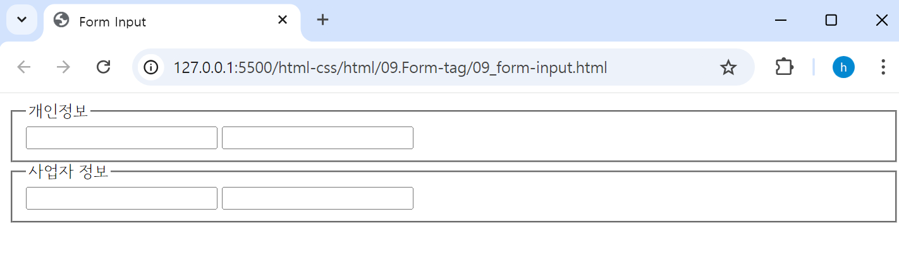
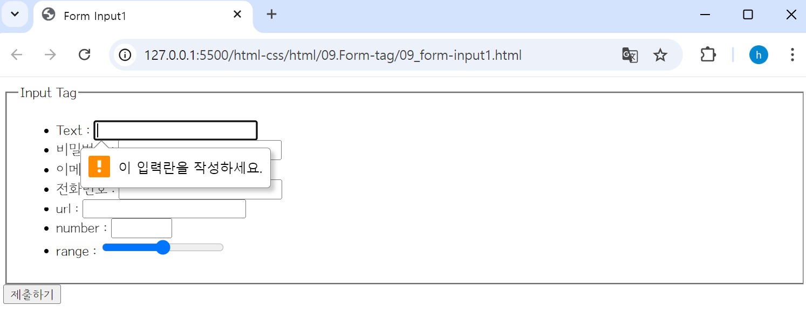

## 🤖 Form 태그
### 🎱 `<form></form>` 태그 
html에서 form(폼) 태그는 웹에서 **사용자의 정보를 입력받기 위해** 사용된다. 
> - ex) 로그인/회원가입/게시판 글쓰기 등 사용자의 데이터를 입력받을 때, ***입력받은 데이터들을 묶은 것***을 `**폼(form)**`이라 하고, 해당 ***데이터***를 `**폼 데이터(form Data)**` 또는 `**필드(field)**`라고 한다.
> - 즉, `<form>`은 **사용자의 정보를 입력받을 수 있게 만들어 놓은 형식**이다.

```html
<form action="">
    <div>
        <label for="username">아이디</label>
        <input type="text" id="username" />
    </div>
    <div>
        <label for="password">비밀번호</label>
        <input type="password" id="password" />
    </div>
    <input type="submit" value="제출하기" />
</form>
```

<br>

### ⚙️ form 태그 속성 
🔩 `action` : 양식 데이터를 처리할 **서버 프로그램의 URI** <br>
🔩 `method` : 양식을 제출할 때 사용할 **HTTP 메서드** <br>
> ⛏️ `post` : 양식 데이터를 요청 본문으로 전송.<br>
> ⛏️ `get` : 양식 데이터를 URL의 쿼리스트링으로 붙여서 전송. <br>

<br>

### 🎱 input/fieldset/legend 태그 
⚙️ `<input></input>` : **데이터를 입력받는 태그**이다. type 속성을 통하여 다양한 방법으로 데이터를 입력받을 수 있다. <br>
⚙️ `<fieldset></fieldset>` : 양식의 **여러 컨트롤과 레이블(`<label>`)을 묶을 때** 사용한다. <br>
⚙️ `<legend></legend>` : **부모 `<fieldset>` 콘텐츠의 설명 태그**이다. <br>
```html
<form action="">
    <fieldset>
        <legend>개인정보</legend>
        <input type="text" />
        <input type="text" />
    </fieldset>
    <fieldset>
        <legend>사업자 정보</legend>
        <input type="text" />
        <input type="text" />
    </fieldset>
</form>
```

<br>

### 🎱 label 태그 
⚙️ `<label></label>` : **입력받는 필드를 설명할 때** 사용한다. 
- `<label>` 태그 하위에 `<input>` 태그를 위치시키거나, 
- id와 for 속성을 사용하여 `<input>` 태그와 연결 짓는 방법이 있다. <br>
<br>

### ⚙️ input 태그 – type 속성값 
```html
<input type="속성값">
```
🔩 **`type` 속성**
> ⛏️ `checkbox` : 체크박스(checkbox)를 정의한다. <br>
> ⛏️ `color` : 색을 선택할 수 있는 입력 필드(color picker)를 정의한다. <br>
> ⛏️ `date` :날짜를 선택할 수 있는 입력 필드를 정의한다. <br>
> - year, onth, day <br>

> ⛏️ `datetime-local` : 날짜와 시간을 선택할 수 있는 입력 필드를 정의함. <br>
> - year, month, day, hour, minute <br>

> ⛏️ `email` : 이메일 주소를 입력할 수 있는 입력 필드를 정의한다. <br>
> - 이메일 유효성 검증 <br>

> ⛏️ `file` : 업로드 할 파일을 선택할 수 있는 입력 필드와 “파일 선택” 버튼을 정의한다. <br>
> ⛏️ `hidden` : 사용자에게는 보이지 않는 숨겨진 입력 필드를 정의한다. <br>
> ⛏️ `image` : 제출 버튼(submit button)으로 사용될 이미지를 정의한다. <br>
> ⛏️ `month` : 날짜를 선택할 수 있는 입력 필드를 정의한다. <br>
> - year, month <br>

> ⛏️ `number` : 숫자를 입력할 수 있는 입력 필드를 정의한다. <br>
> ⛏️ `password` : 비밀번호를 입력할 수 있는 입력 필드를 정의한다. <br>
> ⛏️ `radio` : 라디오 버튼(radio button)을 정의한다. <br>
> ⛏️ `range` : 슬라이드 바를 조정하여 범위 내의 숫자를 선택할 수 있는 입력 필드를 정의한다. <br>
> ⛏️ `reset` : 리셋 버튼(reset button)을 정의한다. <br>
> ⛏️ `search` : 검색어를 입력할 수 있는 텍스트 필드를 정의한다. <br>
> ⛏️ `submit` : 제출 버튼(submit button)을 정의한다. <br>
> ⛏️ `tel` : 전화번호를 입력할 수 있는 입력 필드를 정의한다. <br>
> ⛏️ `text` : type 속성의 기본값으로, 한 줄로 된 텍스트 필드를 정의한다. <br>
> ⛏️ `time` : 시간을 선택할 수 있는 입력 필드를 정의한다. <br>
> - hour, minute <br>

> ⛏️ `url` : URL 주소를 입력할 수 있는 입력 필드를 정의한다. <br>
> ⛏️ `week` : 날짜를 선택할 수 있는 입력 필드를 정의한다. <br>
> - year, week <br>

### 💻 form-input1/html
```html
<form action="">
    <fieldset>
        <legend>Input Tag</legend>
        <ul>
            <li>
                <!-- label 태그 하위에 input 태그 넣기 -->
                <label>
                    Text : 
                    <input type="text" id="text" required />  <!-- required : 서버에 데이터 전송 시 필수 값 체크-->
                </label>
            </li>
            <li>
                <!-- for와 id속성을 사용하여 label 태그와 input 태그 연결 -->
                <!-- type="password" : 비밀번호를 입력할 수 있는 입력 필드를 정의, 데이터가 마스킹 처림됨 -->
                <label for="password">비밀번호 : </label>
                <input type="password" id="password" required />
            </li>    
            <li>
                <!-- type="email" : 이메일 유효성 검사 -->
                <label for="email">이메일 : </label>
                <input type="email" id="email" required />
            </li>    
            <li>
                <!-- type="tel" : tel - 전화번호를 받기위해 사용. (모바일 접근시 키패드가 다름) -->
                <label for="tel">전화번호 : </label>
                <!-- input[type=tel] 단축키 -->
                <input type="tel" id="tel" required /> 
            </li>
            <li>
                <!-- type="url" : url 유효성 검사-->
                <label for="url">url : </label>
                <input type="url" id="url" required /> 
            </li>
            <!-- number/range 최소값, 최댓값 지정 가능 (min, max 속성)-->
            <li>
                <!-- type="number" : 숫자 증가/감소 버튼 활성화 -->
                <label for="number">number : </label>
                <input type="number" id="number" required min="5" max="10"/> 
            </li>
            <li>
                <!-- type="range" : 숫자 조절 컨트롤 바 활성화 -->
                <label for="range">range : </label>
                <input type="range" id="range" required />
            </li>
        </ul>
    </fieldset>
    <input type="submit" value="제출하기" />
</form>
```

<br>
<br>

<br>
<br>

<br>
<br>

<br>
<br>

### 💻 form-input2/html
```html
<form action="">
    <fieldset>
        <legend> 날짜 관련 </legend>
        <ul>
            <li>
                <!-- type="date" : 날짜를 선택할 수 있는 입력 필드를 정의 -->
                <!-- 최소값, 최댓값 지정 가능 (min, max 속성) | 지정 날짜 외 날짜 비활성화 처리 -->
                <label for="date">date : </label>
                <input type="date" id="date" min="2024-09-05" max="2024-09-18" />
            </li>
            <li>
                <!-- type="month" : 날짜를 선택할 수 있는 입력 필드를 정의 (year, month) -->
                <!-- 최소값, 최댓값 지정 가능 (min, max 속성) | 지정 달 외 비활성화 처리 -->
                <label for="month">month : </label>
                <input type="month" id="month" min="2024-08" max="2024-09" />
            </li>
            <li>
                <!-- type="week" : 날짜를 선택할 수 있는 입력 필드를 정의 (year, week) | 현재 몇번째 주 인지 확인 -->
                <label for="week">week : </label>
                <input type="week" id="week" />
            </li>
        </ul>
    </fieldset>
    <fieldset>
        <legend> 시간 관련 </legend>
        <ul>
            <li>
                <!-- type="time" : 시간을 선택할 수 있는 입력 필드를 정의 (hour, minute) -->
                <!-- 최소값, 최댓값 지정 가능 (min, max 속성) | 지정 시간 외 시간 입력은 가능하나, 유효성 검사에서 false 처리 -->
                <label for="time">time : </label>
                <input type="time" id="time" min="14:00" max="19:00" />
            </li>
        </ul>
    </fieldset>
    <input type="submit" value="제출하기" />
</form>
```

<br>
<br>

<br>
<br>

<br>
<br>

<br>
<br>

### 💻 form-input3/html
```html
<form accept="">
    <fieldset>
        <legend>그 외 속성들</legend>
        <ul>
            <li>
                <!-- type="file" : 업로드할 파일을 선택할 수 있는 입력 필드와 “파일 선택” 버튼을 정의 -->
                <!-- default : 파일 하나 업로드, multiple : 다중 파일 선택 가능-->
                <input type="file" multiple />
            </li>
            <li>
                <!-- type="hidden" : 사용자에게는 보이지 않는 숨겨진 입력 필드를 정의, 서버에 데이터를 넘길 때 주로 사용-->
                <input type="hidden" name="" value="" />
            </li>
        </ul>
    </fieldset>
</form>
```

<br>
<br>
