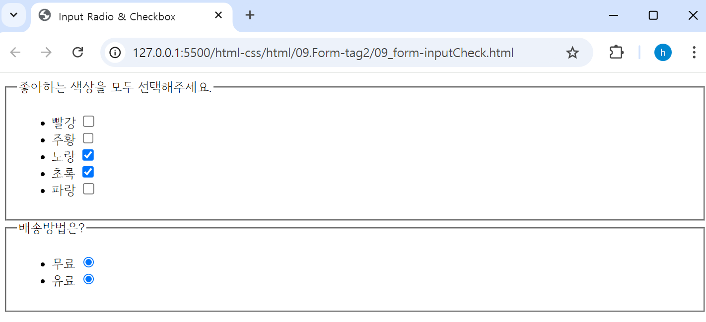

## 🤖 Form 태그
### ⚙️ input 태그 – 그 외 속성값 
🔩 `required` : 폼 데이터(form data)가 서버로 제출되기 전 **반드시 채워져 있어야 하는 입력 필드를 명시**한다. ***(필수 입력값)*** <br>
🔩 `value` : 요소의 **초깃값(value)을 지정**한다. <br>
🔩 `readonly` : `<input>` 요소의 **입력 필드가 읽기 전용**임을 명시한다.
> - 해당 필드 데이터는 서버로 전송되지만, ***데이터 수정이 불가***하다.  <br>

🔩 `disabled` : 해당 `<input>` 요소가 **비활성화**됨을 명시한다. 
> - 해당 필드 ***데이터는 서버로 전송되지 않는다.*** <br>

🔩 `autofocus` : 페이지가 로드될 때 자동으로 **커서가 해당 `<input>` 요소로 이동**됨을 명시한다. <br>
🔩 `placeholder` : `<input>` 요소에 **입력될 값에 대한 짧은 힌트를 명시**한다. 
> - 비어있는 입력 필드에 입력할 가이드 문구/설명을 삽입할 수 있다. <br>

```html
<form action="">
    <fieldset>
        <legend>Input Tag</legend>
        <ul>
            <li>
                <label for="text">Text</label>
                <!-- required : 서버에 데이터 전송 시 필수 입력값 체크-->
                <!-- value : 요소의 초깃값(value) 지정-->
                <!-- readonly : <input> 요소의 입력 필드가 읽기 전용임을 명시-->
                <input type="text" id="text" required value="안녕" readonly /> 
            </li>
            <li>
                <!-- type="email" : 이메일 유효성 검사 -->
                <label for="email">이메일 : </label>
                <!-- disabled : 해당 <input> 요소가 비활성화됨을 명시, 데이터가 서버로 전송 x-->
                <input type="email" id="email" required value="hello@naver.com" disabled/>
            </li>    
            <li>
                <!-- type="tel" : tel - 전화번호를 받기위해 사용. (모바일 접근시 키패드가 다름) -->
                <label for="tel">전화번호 : </label>
                <!-- autofocus : 페이지가 로드될 때 자동으로 커서가 해당 <input> 요소로 이동됨을 명시-->
                <input type="tel" id="tel" required autofocus /> 
            </li>
            <li>
                <!-- type="url" : url 유효성 검사-->
                <label for="url">url : </label>
                <!-- placeholder : <input> 요소에 입력될 값에 대한 짧은 힌트를 명시, 비어있는 입력 필드에 입력할 가이드 문구/설명을 삽입할 수 있다. -->
                <input type="url" id="url" required placeholder="url을 입력해주세요"/> 
            </li>
    </fieldset>
    <input type="submit" value="제출하기" />
</form>
```

<br>

### ⚙️ input 태그 – type 속성값(checkbox & radio) 
🔩 `checkbox` : 여러 개의 **체크박스 항목 중 2개 이상 선택**할 수 있다. 
> - 체크박스 선택 시 선택된 체크박스의 value 값이 서버로 전송된다. <br>

🔩 `radio` : 여러 개의 **라디오 항목 중 1개를 선택**할 수 있다. 
> - 라디오 항목 선택 시 선택된 항목의 value 값이 서버로 전송된다. **radio 버튼 기본적으로 체크 후, 해제 불가** / name 속성으로 그룹핑 필요
> - **여러 개 중 하나를 선택**하게 하려면, 여러 항목의 `<radio name="">`을 통해 ***name 속성 값을 동일 값으로 그룹핑*** 해야 한다. <br>
```html
<form accept="">
    <fieldset>
        <legend>좋아하는 색상을 모두 선택해주세요.</legend>
        <ul>
            <li>
                <label for="red">빨강</label>
                <input type="checkbox" id="red" value="red" />
            </li>
            <li>
                <label for="orange">주황</label>
                <input type="checkbox" id="orange" value="orange" />
            </li>
            <li>
                <label for="yellow">노랑</label>
                <input type="checkbox" id="yellow" value="yellow" />
            </li>
            <li>
                <label for="green">초록</label>
                <input type="checkbox" id="green" value="green" />
            </li>
            <li>
                <label for="blue">파랑</label>
                <input type="checkbox" id="blue" value="blue" />
            </li>
        </ul>
    </fieldset>
    <fieldset>
        <legend>배송방법은?</legend>
        <ul>
            <!-- radio 버튼 기본적으로 체크 후, 해제 불가 name 속성으로 그룹핑 필요-->
            <li>
                <label for="free">무료</label>
                <input type="radio" id="free" name="delivery" value="free" />
            </li>
            <li>
                <label for="pay">유료</label>
                <input type="radio" id="pay" name="delivery" value="pay" />
            </li>
        </ul>
    </fieldset>
</form>
```

> - ***radio 기본 속성은 체크 후, 해제 불가 (1개만 선택하게 하려면, name 속성 사용 필수)*** <br>

<br>


> - ***radio name 속성으로 그룹핑 후, 1개의 데이터만 선택 가능.*** <br>

<br>

### 🎱 Textarea 태그 
⚙️ `<textarea></textarea>` : 여려 줄의 텍스트 데이터를 입력받을 수 있다.

```html
<textarea id="opinion" name="story" cols="30" rows="5">
It was a dark and stormy night...
</textarea>
```
→  텍스트 입력 영역의 크기는 `<textarea>` 요소의 cols 속성과 rows 속성으로 지정할 수 있다. <br>

> 🔩 `rows` : 화면에 표시되는 행수를 지정. <br>
> 🔩 `cols` : 화면에 표시되는 컬럼(열) 수를 지정. <br>
```html
<fieldset>
    <legend>자기소개서</legend>
    <textarea name="" id="" >textarea 테스트</textarea>
    <textarea name="" id="" rows="5" cols="20"></textarea>
</fieldset>
```

<br>
<br>

### 🎱 Select 태그 
⚙️ `<select></select>` : 옵션 메뉴를 제공한다. 
- 🔩 `<option>` 태그로 각 항목을 나타내며 `<select>` 태그는 `<option>` 태그를 감싼다.
- 옵션 안에 있는 내용은 사용자 화면에 출력되는 내용이며, ***실제 서버로 전송되는 값은 value 안의 값***이다. <br>
<br>

> ⛏️ `selected` : 페이지가 로드될 때 옵션 중에서 미리 선택되어지는 옵션을 명시한다. <br>
> ⛏️ `multiple` : 여러 개의 option을 선택할 수 있다. <br>
> ⛏️ `disabled` : 해당 옵션이 비활성화됨을 명시한다. <br>

```html
<fieldset>
    <legend>주문 상품을 선택해주세요!</legend>
    <ul>
        <li>
            <select name="goods" id="goods" multiple>
                <option value="apple_10kg">사과 10kg</option>
                <option value="apple_20kg" selected>사과 20kg</option>
                <option value="apple_30kg">사과 30kg</option>
                <option value="apple_40kg">사과 40kg</option>
                <option value="apple_50kg">사과 50kg</option>
            </select>
        </li>
    </ul>
</fieldset>
```

<br>

### 🎱 datalist 태그 
다른 컨트롤에서 고를 수 있는 가능한, 혹은 추천하는 선택지를 나타내는 `<option>` 요소 여럿을 담습니다. <br>

```html
<li>
    <label for="ice-cream-choice">맛을 선택하세요</label>
    <input list="ice-cream-flavors" id="ice-cream-choice" name="ice-cream-choice" />
    <datalist id="ice-cream-flavors">
        <option value="Chocolate">
        <option value="Coconut">
        <option value="Mint">
        <option value="Strawberry">
        <option value="Vanilla">
    </datalist>
</li>
```

<br>

### 🎱 Button 태그 
클릭 가능한 버튼을 출력한다. `<form>` 내부는 물론이고, 버튼 기능이 필요한 곳이라면 어디에나 배치할 수 있다. <br>

```html
<button type="submit">제출하기</button>
<button type="reset">리셋하기</button>
<button type="button" onclick="alert('Hello World~!')">버튼</button>
```

<br>