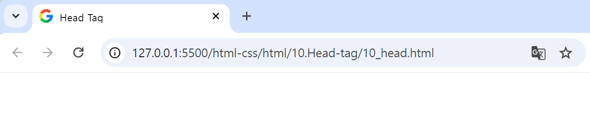

## 🤖 Head 태그
### ⚙️ `<head></head>` : 문서 정보(메타데이터)를 담고 있는 태그다. 
브라우저 화면에 직접적으로 보이지는 않지만, 숨은 데이터를 정의하는 태그들이 들어가 있다.
> -  ex. 대표적인 태그 : `<title>`, `<base>`, `<meta>`, `<link>`, `<style>`, `<script>` 등  <br>

### 🔩 head 안에 배치할 수 있는 요소  
> ⛏️ `<title></title>` : 브라우저의 제목 표시줄이나 페이지 탭에 보이는 **문서 제목을 정의**한다. 
```html
<title>HTML 문서의 제목입니다.</title>
```
<br>

> ⛏️ `<base></base>` : 문서 안의 **모든 상대 경로 URL이 사용할 기준 URL을 지정**한다. 
> - 문서에는 하나의 <base> 요소만 존재할 수 있다.
> - 기준 URL은 외부에서 가져오는 상대 경로의 상위 경로를 절대 경로로 지정하는 것이다. 
```html
<base href="/examples/images/">
```
<br>

> ⛏️ `<link></link>` : 해당 **문서와 외부 소스(external resource) 사이의 관계를 정의**할 때 사용한다.
> - head 요소 내부에만 위치할 수 있으며, 그 개수에는 제한이 없다. 
> - style 시트를 연결할 때 가장 많이 사용되지만, 사이트 아이콘("파비콘"과 홈 화면 아이콘) 연결 등에도 사용된다. 
> - ***https://www.degraeve.com/favicon/ : 파비콘 생성 플랫폼***
```html
<!-- 파비콘 설정 -->
<link rel="shortcut icon" href="./favicon.ico" />

<!-- Style 시트 연결 -->
<link href="/style.css" rel="stylesheet">
```
<br>

> ⛏️ `<style></style>` : html에 대한 **style 규칙을 설정**할 수 있다. 
```html
<style>
        .p { text-decoration: underline; }     
</style>
```
<br>

> ⛏️ `<meta>` : `<base>`, `<link>`, `<script>`, `<style>`, `<title>`과 같은 다른 메타 관련 요소로 **나타낼 수 없는 다양한 종류의 메타데이터**를 나타낸다.
```html
<meta name="description" content="HTML meta tag page">
```
<br>

> ⛏️ `<script></script>` : 데이터나 **자바스크립트 코드를 웹 문서에 포함**할 때 사용한다. 
```html
<script src="/examples/scripts/script_src.js"></script>
```
<br>

### 🎱 오픈그래프 - Open Graph
콘텐츠의 요약 내용이 SNS에 게시되는데 최적화된 데이터를 가지고 갈 수 있도록 설정하는 것을 말한다. 

#### 💻기본적으로 웹에 설정해줘야하는 og 메타태그
```html
<meta property="og:type" content="website">
<meta property="og:url" content="https://example.com/page.html">
<meta property="og:title" content="Content Title">
<meta property="og:image" content="https://example.com/image.jpg">
<meta property="og:description" content="Description Here">
<meta property="og:site_name" content="Site Name">
<meta property="og:locale" content="en_US">

<!-- 다음의 태그는 필수는 아니지만, 포함하는 것을 추천함 -->
<meta property="og:image:width" content="1200">
<meta property="og:image:height" content="630">
```
<br>

#### 💻Naver 블로그, 카카오톡 미리보기 설정
```html
<meta property="og:title" content="콘텐츠 제목" /> 
<meta property="og:url" content="웹페이지 URL" />
<meta property="og:type" content="웹페이지 타입(blog, website 등)" />
<meta property="og:image" content="표시되는 이미지" /> 
<meta property="og:title" content="웹사이트 이름" /> 
<meta property="og:description" content="웹페이지 설명" />
```
<br>

#### 💻 트위터 미리보기 설정
```html
<meta name="twitter:card" content="트위터 카드 타입(요약정보, 사진, 비디오)" /> 
<meta name="twitter:title" content="콘텐츠 제목" /> 
<meta name="twitter:description" content="웹페이지 설명" /> 
<meta name="twitter:image" content="표시되는 이미지 " />
```
<br>

#### 💻 모바일 앱 미리보기 설정
```html
<-- iOS -->
<meta property="al:ios:url" content=" ios 앱 URL" />
<meta property="al:ios:app_store_id" content="ios 앱스토어 ID" /> 
<meta property="al:ios:app_name" content="ios 앱 이름" /> 

<--Android-->
<meta property="al:android:url" content="안드로이드 앱 URL" />
<meta property="al:android:app_name" content="안드로이드 앱 이름" />
<meta property="al:android:package" content="안드로이드 패키지 이름" /> 
<meta property="al:web:url" content="안드로이드 앱 URL" />
```
<br>


### 🎱 10_head.html 실습
```html
<!DOCTYPE html>
<html lang="en">
<head>
    <meta charset="UTF-8">
    <meta name="viewport"content="width=device-width, initial-scale=1.0">
    <base href="/html-css/html/assets/"> 
    <link rel="icon"href="./favicon.ico">
    <title>Head Tag</title>
</head>
<body></body>
</html>
```


